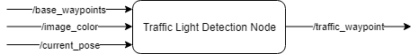
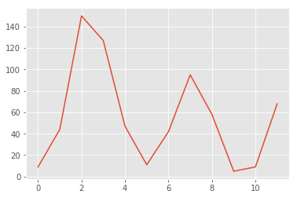
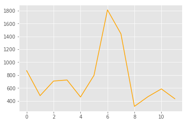
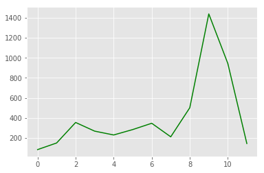
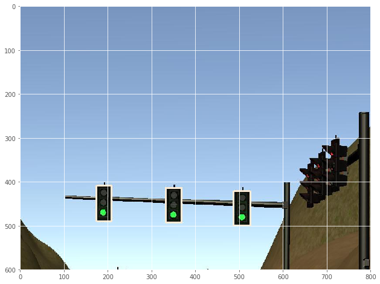

### Traffic light detection node

We tested the SSD_INCEPTION, SSD_MOBILE_V2 and FASTER_RCNN frozen models supplied by [Tensorflow](https://github.com/tensorflow/models/blob/master/research/object_detection/g3doc/detection_model_zoo.md), and eventually settled for the F-RCNN model due to its remarkable speed and accuracy. 

 

The process is to find traffic lights, and then classify then as red, yellow, green or off (which would we classified as red).

We considered using an additional classification layer which would classify the boxed traffic model images using a conventional data science approach, but this didn't seem to add value to the RCNN's acuracy. The idea was to detect which area of the boxed traffic light was brighter - with the idea that sometimes a red/ green light might be perceived as a different color due to lighting conditions (for instance morning/ afternoon light), which might throw the RCNN off. 

The process was use a grey-scale version of the image, and do a row-sum of the pixel values (brighter pixels have higher values). After this we calculate the brightness for different sections of the image and in this way we create features for a supervised machine learning model. 

The result for red, yellow and green lights are as follows (respectively)

 

 

 

The randomforsest classificatier model we built had a 81% accuracy on the first attempt, based only on this featureset - which is not bad. But it didn't seem to add value to the RCNN model - it already proved to be working well :) 

Below is an image of the classifcation of an camera snapshot with green traffic lights: 
 
Each box traffic light was labelled as green, with a confidence of 0.998 (rounded) 

The results was sent the the waypoint updater, which instructed the car on its next action (stop or drive on).
